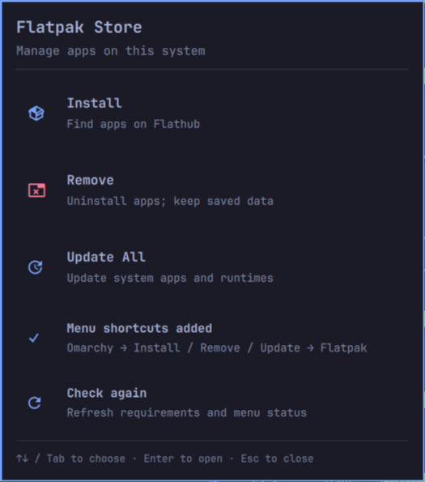

# [Flatpak Store](https://plugins.omarchy.org/plugin.html?id=ipkalid.flatpak-store)


An Omarchy shell plugin with three actions:

- **Install** — browse Flathub with Omarchy-style terminal pickers.
- **Remove** — select installed system apps; retain saved app data.
- **Update All** — update all system Flatpak apps and runtimes in one operation.

Install and Update All automatically confirm Flatpak’s prompts and show progress.
Remove shows Flatpak’s normal confirmation and progress.



## Install the plugin

```sh
omarchy plugin add https://github.com/ipkalid/omarchy-flatpak.git --enable
omarchy-shell shell summon ipkalid.flatpak-store '{}'
```

Choose **Add menu shortcuts** in the centered panel to add **Omarchy → Install →
Flatpak**, **Remove → Flatpak**, and **Update → Flatpak**. Once configured, the panel
shows **Menu shortcuts added**. There is no top-level Flatpak Store menu entry.
You can always summon the panel with the command above.

Enabling or opening the plugin does not edit your menu or install dependencies.
Omarchy plugins can run bundled scripts with your user permissions; this plugin
runs its setup helper only when you choose **Add menu shortcuts**.

### Requirements

Omarchy with the Quattro plugin system and `qs.Ui` panel components, Bash 4+,
Python 3 for menu setup, `flatpak`, `fzf`, `xdg-terminal-exec`, and the standard
Arch utilities `awk`, `sort`, `readlink`, `mktemp`, and GNU `timeout`.

```sh
omarchy pkg add flatpak fzf python
# Only needed for installation if system Flathub is missing:
flatpak remote-add --system --if-not-exists flathub https://flathub.org/repo/flathub.flatpakrepo
```

The panel checks requirements on open and before launching an action. If Flatpak
is missing, it shows `omarchy pkg add flatpak` and disables all package actions.
Missing `fzf` disables Install and Remove, with `omarchy pkg add fzf` shown.
Missing Python disables shortcut setup, with `omarchy pkg add python` shown.
Run the suggested command in a terminal, then choose **Check again**.
Direct action summons also show this guidance if requirements are missing.
Closing the panel cancels any pending launch while a check is running.

Update All needs only `flatpak` and Bash. Removing apps and browsing installed
app details work offline without Flathub. Updates cover every system remote;
user-only installations are outside this version’s scope.

## Controls and behavior

In the panel, use the mouse, arrow keys, J/K, or Tab/Shift+Tab to choose an action.
Enter or Space opens it; Escape or clicking outside closes the panel. Actions
open detached terminals, so closing or disabling the panel does not interrupt an
ongoing package transaction. No second Quickshell process is started.

In the installation and removal pickers:

- Type to search app names only; descriptions and IDs remain visible.
- Tab selects multiple apps; Enter installs immediately or opens Flatpak’s removal confirmation.
- Alt+P toggles details; Alt+J/K scroll; Alt+D/U scroll half a page.
- Escape cancels without changing apps.

The pickers follow Omarchy’s prompt, shortcut footer, and green/red markers.
Names are aligned and sorted; descriptions are subdued. Installed apps have a ✓
beside their names. Full references retain architecture and branch for operations.

Installation waits up to 45 seconds for the Flathub catalog, then tries a local
cache with a visible stale-data notice. Previews time out after 15 seconds.
Removal preserves saved app data and does not force removal or separately clean
up unused runtimes. Install and Update All use `--assumeyes` to skip confirmation.
Update All runs `flatpak update --system --assumeyes`. Errors and completed
operations remain visible until Enter is pressed.

The plugin runs with your user permissions, as other Omarchy plugins do. Flatpak
handles any required system authentication. The plugin does not run `sudo`,
download executables at startup, or run a background service.

## Menu setup, migration, and cleanup

The panel's **Add menu shortcuts** button runs `menu.py setup`. It adds three direct
shortcuts, preserves other entries and JSONC comments, and backs up changed files.
It migrates exact entries from the older standalone installer and removes the
old top-level Flatpak Store entry only if it still matches this plugin's generated
entry. Customized root entries are preserved. Conflicting action shortcuts stop
setup before writing anything; the panel displays the error. Setup is safe to repeat.

The CLI is also available. `status` is read-only; `--json` returns a structured
result for status, setup, or cleanup, including errors (nonzero exit status):

```sh
python3 -B ~/.config/omarchy/plugins/ipkalid.flatpak-store/menu.py status --json
python3 ~/.config/omarchy/plugins/ipkalid.flatpak-store/menu.py setup --dry-run
python3 ~/.config/omarchy/plugins/ipkalid.flatpak-store/menu.py setup
```

To remove the plugin, clean up its menu entries first:

```sh
python3 ~/.config/omarchy/plugins/ipkalid.flatpak-store/menu.py cleanup
omarchy plugin remove ipkalid.flatpak-store
```

Cleanup removes only entries that still exactly match this plugin’s generated
entries. Your edited entries are retained and may need manual removal. Installed
apps and saved data are retained. Disabling the plugin does not remove its menu
shortcuts; clean them up if you no longer want them displayed.

The older `~/.local/bin/flatpak-store` remains available if you installed the
standalone tool previously; it is a separate copy and is not updated by plugin
updates. The plugin always launches its own bundled script. The legacy
`install.py` is retained for standalone use; plugin users should use `menu.py`.

## Update the plugin

```sh
omarchy plugin update ipkalid.flatpak-store
```

This updates the plugin code. **Update All** in the panel updates Flatpak apps
and runtimes instead.

## CLI and shell interface

Run the bundled `flatpak-store` with no argument to install, `remove` to uninstall,
or `update` to update all system apps and runtimes.

```sh
omarchy-shell shell summon ipkalid.flatpak-store '{"action":"install"}'
omarchy-shell shell summon ipkalid.flatpak-store '{"action":"remove"}'
omarchy-shell shell summon ipkalid.flatpak-store '{"action":"update"}'
omarchy-shell shell hide ipkalid.flatpak-store
```

Empty or invalid payloads open the panel without launching a package operation.
Only the three documented action strings are accepted.

## Verify

```sh
omarchy plugin validate .
python3 verify_qml.py
bash -n flatpak-store check-dependencies
shellcheck flatpak-store check-dependencies
python3 -m unittest discover -s tests -v
```

Tests additionally require Node.js. They use temporary homes and stub package
commands, so they do not change your desktop configuration or installed apps.
The QML check uses your installed Omarchy shell imports and Qt’s `qmllint`.

References: [Omarchy development guide](https://plugins.omarchy.org/develop.html),
[publishing guide](https://plugins.omarchy.org/publish.html),
[Flatpak command reference](https://docs.flatpak.org/en/latest/flatpak-command-reference.html).
