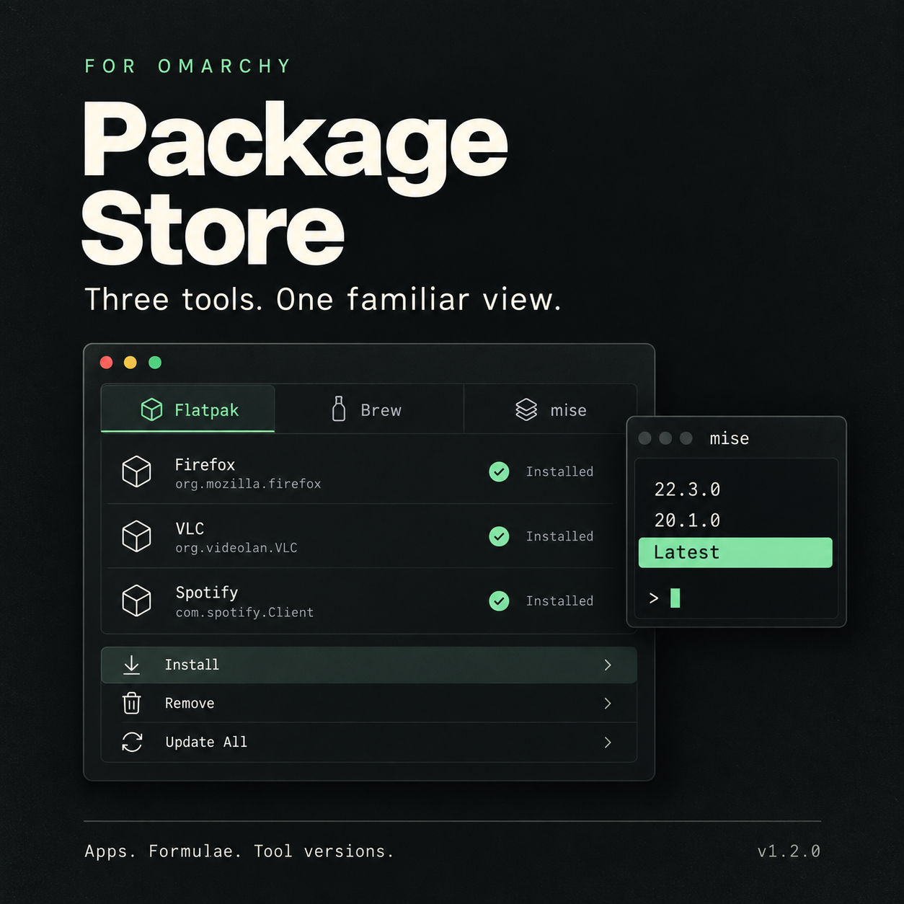

# [Package Store](https://plugins.omarchy.org/plugin.html?id=ipkalid.flatpak-store)


An Omarchy shell plugin with matching **Flatpak**, **Brew**, and **mise** views.
Use the provider tabs (or Left/Right) to switch between them.

| Provider | Install | Remove | Update All |
| --- | --- | --- | --- |
| Flatpak | Browse system Flathub apps | Select system apps; keep saved data | Update system apps and runtimes |
| Brew | Browse Homebrew formulae | Select installed formulae and confirm | Refresh metadata, then upgrade packages |
| mise | Choose a tool, then Latest or an exact version | Choose a tool, then installed versions and confirm | Not provided |

mise installation selects **Latest** at the bottom beside the prompt, with newer
explicit versions nearest it above. Latest installs `tool@latest`, letting mise resolve the latest eligible
release when the installation starts. Installation does **not** change global or
project defaults. Removal leaves
mise configuration untouched, including references to removed versions. Brew
supports Linux formulae, including configured taps; casks and tap management are
outside this version's scope. mise installation browses its bundled registry;
custom backend entry is not provided.

The plugin ID remains `ipkalid.flatpak-store` so existing installations and
Flatpak shortcuts continue working.



*Marketing illustration; the actual panel uses your Omarchy theme.*

## Install the plugin

```sh
omarchy plugin add https://github.com/ipkalid/omarchy-flatpak.git --enable
omarchy-shell shell summon ipkalid.flatpak-store '{}'
```

Choose **Add menu shortcuts** in the centered panel to add **Omarchy → Install →
Flatpak / Brew / mise**, **Remove → Flatpak / Brew / mise**, and
**Update → Flatpak / Brew**. Once configured, the panel
shows **Menu shortcuts added**. There is no top-level Package Store menu entry.
You can always summon the panel with the command above.

Enabling or opening the plugin does not edit your menu or install dependencies.
Omarchy plugins can run bundled scripts with your user permissions; this plugin
runs its setup helper only when you choose **Add menu shortcuts**.

### Requirements

Omarchy with the Quattro plugin system and `qs.Ui` panel components, Bash 4+,
`xdg-terminal-exec`, and standard Arch utilities. Install and Remove need `fzf`.
Each provider needs its own package manager; an unavailable provider
does not disable the others. Brew and mise actions additionally require Python 3,
as does menu setup. Catalog lookups use GNU `timeout`.

```sh
omarchy pkg add flatpak fzf python mise
# Only needed for Flatpak installation if system Flathub is missing:
flatpak remote-add --system --if-not-exists flathub https://flathub.org/repo/flathub.flatpakrepo
```

The Brew view respects `brew` already on PATH, then checks `HOMEBREW_PREFIX`,
`/home/linuxbrew/.linuxbrew`, and `~/.linuxbrew`. Its dependency probe and launcher
use the same detected prefix, even when the desktop PATH differs from a terminal.
For other custom locations, expose `brew` on the desktop PATH or set
`HOMEBREW_PREFIX`. If Brew is not installed, follow [brew.sh](https://brew.sh). The plugin never installs package managers
automatically. If a requirement is missing, the panel shows guidance and disables
the affected actions. Run the suggested command, then choose **Check again**.
Direct action summons use the same checks. Closing the panel or switching
providers cancels a pending launch while requirements are being checked.

The same requirement checks run for Flatpak, Brew, and mise when opening a view,
using a direct menu shortcut, or launching an action. Missing `fzf` or `timeout`
disables Install and Remove; missing `xdg-terminal-exec` disables all package
actions. Missing Python disables Brew/mise actions and menu setup, while Flatpak
package actions remain usable. Each message explains how to install the missing
requirement, and **Check again** re-enables actions once it is available.

Flatpak Update All needs only Flatpak and Bash; Brew Update All needs Brew and
Python. Removal reads local installed-package information and does not fetch an
installation catalog. Flatpak updates cover every system remote; user-only
Flatpak installations remain outside this version's scope.

## Controls and behavior

In the panel, use Left/Right (or H/L) to switch providers. Use the mouse,
Up/Down, J/K, or Tab/Shift+Tab to choose an action.
Enter or Space opens it; Escape or clicking outside closes the panel. Actions
open detached terminals, so closing or disabling the panel does not interrupt an
ongoing package transaction. No second Quickshell process is started.

In the installation and removal pickers:

- Type to search names (or versions in the mise version picker); descriptions remain visible.
- Tab selects multiple Flatpak apps, Brew formulae, or mise versions for removal.
  mise installation selects one tool and one version at a time.
- Enter installs the selection or opens removal confirmation.
- Alt+P toggles details; Alt+J/K scroll; Alt+D/U scroll half a page.
- Escape cancels without changing apps.

The pickers follow Omarchy’s prompt, shortcut footer, and green/red markers.
Names are aligned and sorted; descriptions are subdued. Installed entries have a ✓
beside their names. mise version lists display backend ordering in reverse, newest first; the version
picker keeps the same bottom prompt and selection layout as the other pickers.
Removal lists only installed versions. Full Flatpak
references retain architecture and branch for operations. Brew details are fetched
for the highlighted formula; descriptions already available locally appear in rows.

The picker opens immediately with fzf’s native spinner beside `0/0`, an empty
app list, and the preview pane, just like the AUR picker. You can type a search
or press Escape while the catalog loads. Escape also stops the pending lookup.
Flatpak installation waits up to 45 seconds for the Flathub catalog, then tries a local
cache with a visible stale-data notice. Previews time out after 15 seconds.
Flatpak removal preserves saved app data and does not force removal or separately
clean up unused runtimes. Flatpak Install and Update All use `--assumeyes` to skip
confirmation. Flatpak Update All runs `flatpak update --system --assumeyes`. Errors and completed
operations remain visible until Enter is pressed.

Brew and mise catalog queries time out after 45 seconds each; Brew previews time
out after 15 seconds. Empty results and lookup failures are shown explicitly.
Escape stops the pending lookup. Package transactions have no lookup timeout.
Brew Update All runs `brew update` and, on success, `brew upgrade`,
respecting normal Homebrew pinning. Brew removal does not force dependency
removal or add a separate cleanup command; Homebrew's normal behavior applies.
mise commands run from your home directory so launching the panel from a project
does not implicitly select that project's configuration.

The plugin runs with your user permissions, as other Omarchy plugins do. Flatpak
handles any required system authentication. The plugin does not run `sudo`,
download executables at startup, or run a background service.

## Menu setup, migration, and cleanup

The panel's **Add menu shortcuts** button runs `menu.py setup`. It adds eight direct
shortcuts, preserves other entries and JSONC comments, and backs up changed files.
It migrates exact entries from the older standalone installer and removes the
old top-level Flatpak Store entry only if it still matches this plugin's generated
entry. Customized root entries are preserved. Conflicting action shortcuts stop
setup before writing anything; the panel displays the error. Setup is safe to repeat.

The CLI is also available. `status` is read-only; `--json` returns a structured
result for status, setup, or cleanup, including errors (nonzero exit status):

```sh
python3 -B ~/.config/omarchy/plugins/ipkalid.flatpak-store/menu.py status --json
python3 ~/.config/omarchy/plugins/ipkalid.flatpak-store/menu.py setup --dry-run
python3 ~/.config/omarchy/plugins/ipkalid.flatpak-store/menu.py setup
```

To remove the plugin, clean up its menu entries first:

```sh
python3 ~/.config/omarchy/plugins/ipkalid.flatpak-store/menu.py cleanup
omarchy plugin remove ipkalid.flatpak-store
```

Cleanup removes only entries that still exactly match this plugin’s generated
entries. Your edited entries are retained and may need manual removal. Installed
packages, tool versions, and saved data are retained. Disabling the plugin does not remove its menu
shortcuts; clean them up if you no longer want them displayed.

The older `~/.local/bin/flatpak-store` remains available if you installed the
standalone tool previously; it is a separate copy and is not updated by plugin
updates. The plugin always launches its own bundled script. The legacy
`install.py` is retained for standalone use; plugin users should use `menu.py`.

## Update the plugin

```sh
omarchy plugin update ipkalid.flatpak-store
```

This updates the plugin code. **Update All** in the panel updates packages for
the selected provider.

## CLI and shell interface

Run the bundled `flatpak-store` with no argument to install, `remove` to uninstall,
or `update` to update all system apps and runtimes.

```sh
omarchy-shell shell summon ipkalid.flatpak-store '{"action":"install"}'
omarchy-shell shell summon ipkalid.flatpak-store '{"action":"remove"}'
omarchy-shell shell summon ipkalid.flatpak-store '{"action":"update"}'
omarchy-shell shell hide ipkalid.flatpak-store
```

Use `provider` to target Brew or mise. Omitting it continues to target Flatpak.
A provider-only payload opens that provider's view without launching an action.

```sh
omarchy-shell shell summon ipkalid.flatpak-store '{"provider":"brew","action":"install"}'
omarchy-shell shell summon ipkalid.flatpak-store '{"provider":"brew","action":"update"}'
omarchy-shell shell summon ipkalid.flatpak-store '{"provider":"mise","action":"install"}'
omarchy-shell shell summon ipkalid.flatpak-store '{"provider":"mise","action":"remove"}'
```

The bundled `brew-store` and `mise-store` runners default to installation. Both
accept `install` and `remove`; `brew-store` also accepts `update`. Each runner
launches the shared `package_store.py` adapter from its plugin directory.

Empty or invalid payloads open the panel without launching a package operation.
Unknown providers/actions and the unsupported mise/update combination cannot
launch a transaction.

## Verify

```sh
omarchy plugin validate .
python3 verify_qml.py
for script in flatpak-store check-dependencies brew-store mise-store brew-path.sh; do bash -n "$script"; done
shellcheck flatpak-store check-dependencies brew-store mise-store brew-path.sh
python3 -m unittest discover -s tests -v
```

Tests additionally require Node.js. They use temporary homes and stub package
commands, so they do not change your desktop configuration or installed apps.
The QML check uses your installed Omarchy shell imports and Qt’s `qmllint`.

References: [Omarchy development guide](https://plugins.omarchy.org/develop.html),
[publishing guide](https://plugins.omarchy.org/publish.html),
[Flatpak command reference](https://docs.flatpak.org/en/latest/flatpak-command-reference.html),
[Homebrew command reference](https://docs.brew.sh/Manpage),
[mise command reference](https://mise.jdx.dev/cli/).
